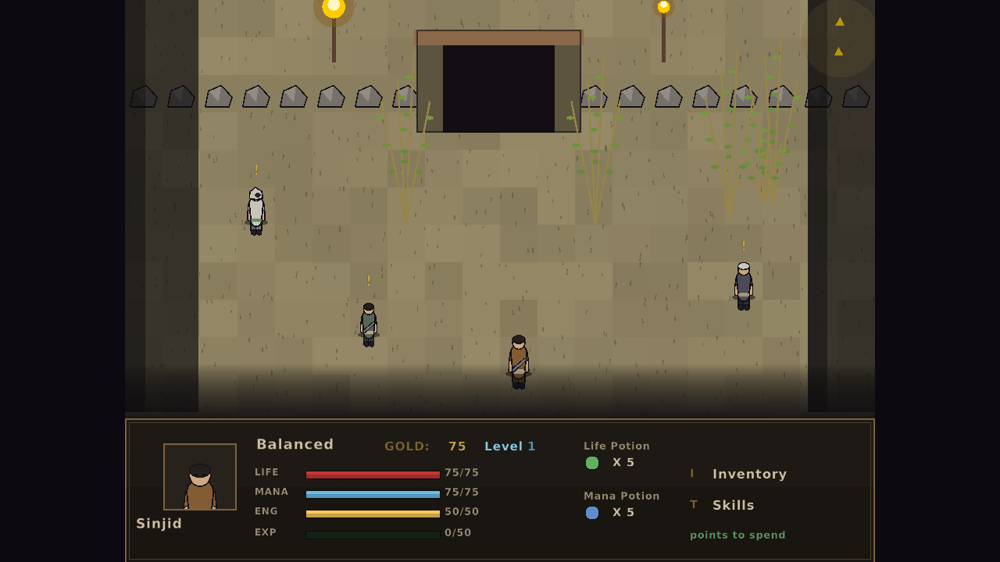
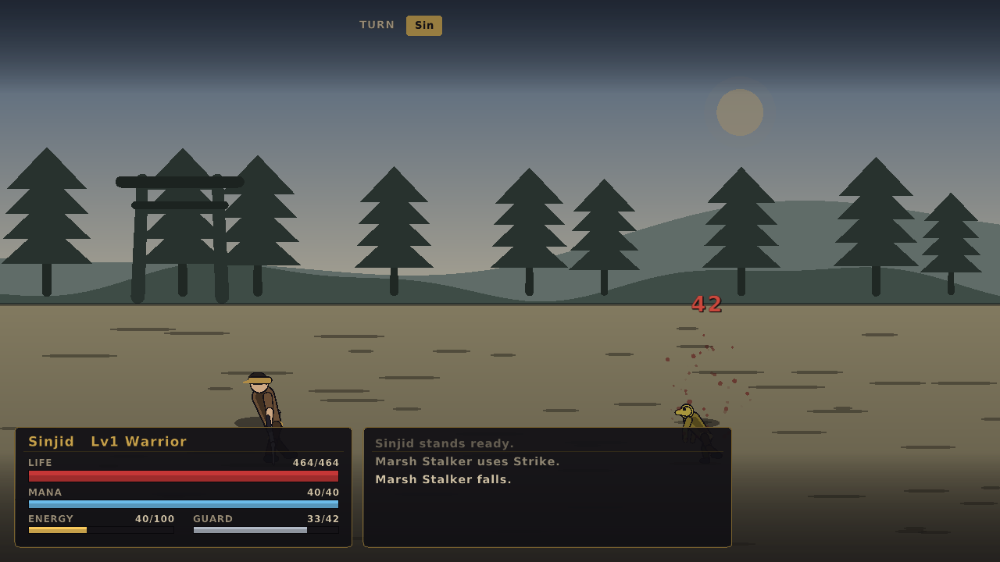

# Sinjid: Shadow of the Warrior — a raylib/C remake

An unofficial fan remake of the 2004 browser RPG *Sinjid: Shadow of the Warrior*
(Infrarift), written from scratch in C99 with [raylib](https://www.raylib.com/).

**There are no asset files in this project.** Every character, weapon, shield,
tile, background, particle and UI element is drawn procedurally at runtime by
`src/art.c`. Nothing was extracted from the original game; the item names,
skills, enemies, maps and writing are all original to this remake.





## Building

Requires a C99 compiler and **raylib 6.0 or newer** (developed and tested
against raylib `6.1-dev`, master @ 2b991b0).

```sh
make                      # uses pkg-config to find raylib
make RAYLIB=/path/to/raylib   # or point at a raylib source tree
./sinjid
```

On Debian/Ubuntu, raylib's own build needs the usual GL/X11 headers:

```sh
sudo apt install libgl1-mesa-dev libx11-dev libxrandr-dev \
                 libxinerama-dev libxcursor-dev libxi-dev

git clone --depth 1 https://github.com/raysan5/raylib
make -C raylib/src PLATFORM=PLATFORM_DESKTOP
make RAYLIB=./raylib
```

## Controls

| key | action |
| --- | --- |
| arrows / WASD | walk, move the cursor |
| ENTER / SPACE | talk, confirm |
| ESC | back, open the menu |
| I | character, pack and skills |
| T | training (spend stat and skill points) |
| TAB / Q / E | switch tabs |

Talk to the shrine in the village to rest and save; the save file is written to
`sinjid_save.dat` in the working directory.

## Fidelity: what is taken from the original, and what is not

The original is a Flash file, so its logic is recoverable: the ActionScript
bytecode still carries named functions (`heroDamage`, `enemyDamage`,
`speedorder`, `EnemyMeet`, `ItemRand`, `EquipItem`) and the full variable
table. The combat maths below was disassembled from it and is reproduced
faithfully here.

### Verified against the bytecode, and implemented

**Damage.** Every defence is a *percentage* reduction, not a flat subtraction,
and a blow is three separate components metered by different defences:

```
totaldmg = round( (phydmg - ceil(phydmg/100 * target.phydef))
                + (magdmg - ceil(magdmg/100 * target.magdef))
                + (strdmg - ceil(strdmg/100 * target.phydef)) ) + ran
```

**The shield layer.** While a fighter has shield points, the entire blow is
spent on them, using the shield's own percentages plus the attacker's extra
shield damage:

```
shddmg = round( (phydmg - ceil(phydmg/100 * target.shdphydef))
              + (magdmg - ceil(magdmg/100 * target.shdmagdef))
              + (strdmg - ceil(strdmg/100 * target.shdphydef))
              + dmgtoshd ) + ran
```

If that exceeds the remaining points the guard breaks and the shield drops to
zero — **the overflow is discarded**, so a broken guard still takes no life
damage that turn. This is why shield-breaking weapons exist and why a heavy
shield is a wall rather than a damage buffer.

**Hitting and missing** is a speed roll, not an accuracy stat:

```
spdran1 = random(atkspd/2) + atkspd/2     // attacker
spdran2 = random(target.speed/2)          // defender, or -1 when nomiss
hit if spdran2 < spdran1
```

**Turn order** (`speedorder`) sorts the four combatants purely on speed,
descending — there is no per-round initiative randomness.

**The item table** is the original's own, recovered from its `AddItem()` calls:
63 items across Weapon / Shield / Head Gear / Suit / Relic / Drink / Herb, with
their real damage, defence, shield and speed numbers. That includes the
**Strength requirement** (`strneed`) every item carries — you cannot wear what
you are not strong enough to hold, which is what makes Strength worth training.
Weapons like *Shield Breaker* (40 extra shield damage) and *Guard Blade* (90
physical damage at the cost of 40 mana) behave exactly as their numbers say.

**The enemy roster** is the original's, all 47 encounter definitions recovered
from its per-encounter setup scripts — absolute stats rather than a level
curve, including each fighter's weapon and shield. That covers the whole cast:
Thief, Bandit, Raider, Warrior, Assailant, Seer, Shaman, Ronin, Samurai,
Mercenary, Agent, Skeleton, Skeleton Mage, Undead, Poison Wasp, Mountain Naga,
Golem, Semi Demon, Flesh Fiend, Liquid Metal, Blood Spirit, Fallen Guardian,
Anti Ninja, Shadow Reaper and the Training Ward. A couple of them carry
*negative* magic defence, which amplifies spells rather than blunting them, so
the damage code clamps only the upper bound.

**The four disciplines** are the original's — Balanced, Warrior, Spell Caster,
Shadow Ninja — together with its class table, which turns out to be per-level
growth in `[speed, toughness, magic damage, physical damage]`:

| discipline | speed | toughness | magic | physical |
| --- | --- | --- | --- | --- |
| Balanced | 2 | 2 | 10 | 10 |
| Warrior | 1 | 3 | 5 | 15 |
| Spell Caster | 2 | 1 | 15 | 10 |
| Shadow Ninja | 3 | 1 | 10 | 10 |

**The starting state** is the original's too: 75 life, 75 mana, 50 energy, 15
Strength, 15 Speed, zero physical/magic damage and no shield points, 75 gold,
50 experience to the second level, an Iron Knife and nothing else worn.

**The map layouts** are the original's own. Its stage scripts build each screen
by setting `game.cell{x}_{y}.type = 2` on a 20-wide grid, and all eleven of
those layouts are reproduced cell for cell, with the stage names and backdrop
each one selects. The village screen is laid out on the original's timeline
rather than in a stage script, so that one screen is ours.

**The NPC and prop cast** is the original's, taken from its clip labels --
Elder, Scribe, Healer, Item Vendor and Item Vendor 2, Food Vendor, Potion
Vendor, Ninja, Dark Ninja, Guard, Lady, Drunkard, Drinker, Relaxing Ninja,
Meditating Ninja, Wounded Warrior, Apprentice, Student, Statue, and props like
the crate, barrel, urn, bamboo and posted note. Each one fills the same role it
fills in the original. **Their dialogue is written for this remake** -- the
original's writing is the one thing a remake should not copy, so every line is
new, and only the role behind it is faithful.

**The trainable stat list** matches the original's own: Life Points, Mana
Points, Strength, Physical Damage, Magic Damage, Physical Defence, Magic
Defence, Shield Points, Speed.

Also reproduced: two fighters a side; the nine animation states (`stand, walk,
attack, block, blockbreak, hit, heal, die, miss`); segmented-puppet fighters;
a tile overworld with random encounters; and a village hub of vendors, healer,
trainer, save shrine and arena.

`strdmg` is read by both damage functions but assigned outside them, so its
source is not confirmed; this remake feeds it from Strength.

### Still original to this remake

* **All art and animation** — every pixel is drawn by `art.c`; no asset from
  the original is used or redistributed
* **All writing** — item notes, skill descriptions, NPC dialogue, class blurbs
* **The 19 skills**, their effects, costs and ranks. The original keeps no
  skill table: the effects are inlined in its combat code, so these are ours.
* **Item prices**, derived from each item's stats
* **The exp curve and level-up rewards.** Only the first level's cost (50) is
  the original's; `expmaxb` turns out to be a display binding, so the growth
  rule was not recoverable.
* **Every map.** The original is built from three portals of twenty stages
  each (HUMAN, MONSTER and DARK, over Snow / Coast / Grass / Desert), which
  this remake does not reproduce — it uses six hand-drawn zones instead.
* the effects of the three zero-stat rows in the source table (Medicine, White
  Leaves, Mendo's Ring) and the trailing food and drink rows
* the energy economy and the buff / stun / drain mechanics

So the systems, the combat maths, the items, the enemies and the classes are
the original's, verified from its bytecode; the presentation, the writing, the
skills and the level design are new.

## Layout

| file | contents |
| --- | --- |
| `src/game.h` | all types, the palette, and the module interfaces |
| `src/art.c` | the whole renderer: puppets, poses, weapons, tiles, backgrounds |
| `src/battle.c` | turn order, damage resolution, enemy AI, battle HUD |
| `src/world.c` | zone maps, walking, NPCs, encounters, travel |
| `src/ui.c` | panels, bars, and the menu/shop/training/title screens |
| `src/data.c` | items, skills, enemies, classes |
| `src/main.c` | window, game loop, scene dispatch, save files, scripted input |

### How the characters are drawn

`art.c` has no sprites. A fighter is a skeleton — hip, chest, neck, head, two
arms with elbows and hands, two legs with knees and feet — and an animation is a
set of keyframed joint angles blended together (`pose_attack` winds up behind the
head, then drives through with the hips). Limbs are drawn as tapered capsules
with an ink outline pass underneath, which is what gives the flat 2004 vector
look. Equipment is a shape family (`WEAP_KATANA`, `SHLD_KITE`, `HELM_HORNED`…)
drawn at the hand or head with the item's own tint, so a new weapon changes the
silhouette without any new art.

## Scripted input

For screenshots and CI the game can play itself:

```sh
./sinjid --script "ret,wait40,ret,ret,wait90,shot:village,down,down,quit"
```

Tokens are key names (`up`, `down`, `left`, `right`, `ret`, `esc`, `tab`, single
letters), `waitN` frames, `shot:name` to write `name.png`, and `quit`. It runs
fine under Xvfb with software GL.

## Licence and attribution

This is a fan project, not affiliated with or endorsed by the creators of the
original game. The code and all generated art here are original work.
